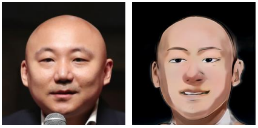
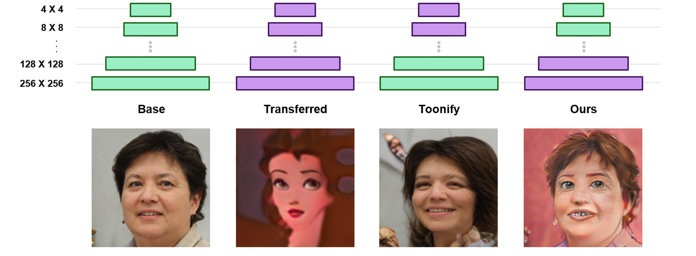

# Fine-Tooning: Realistic Cartoonization of Myself

<p align="center">
    
</p>


## Related Works

* StyleGAN
    * Generates a high-resolution image from the latent space
* Toonify Method
    * Mixes image domains using two StyleGANs
    * One StyleGAN is trained from the original StyleGAN using a cartoon dataset by transfer learning


## Improvements

* Optimal Layer Swapping
    * The original Toonify method shows an effective way for changing the style of an image through layer swapping, but facial structure is not preserved
    * From layer swapping experiments, we confirmed low-resolution layers to be important for structure preservation
    * The figure below shows qualitative comparison of different StyleGANs
    
    <br>
    <p align="center">
        
    </p>

* Experiments in Different Data Domains
    * Using our method, we discovered that the original dataset failed producing certain realistic features (ex. Hair color)
    * A Naver Webtoon image set showed better results

    <br>
    <p align="center">
        
    </p>

* Fine-Tooning with Triplet loss
    * Adjust our model parameter so our toonified face embedding can be close to real face embedding, while being far from more toon-like face embedding
    * Cosine similarity was used for the distance term.

    <br>
    <p align="center">
        
    </p>

    * After training, we were able to preserve more general face features such as skin and hair color or facial shape.
    * Detailed feature improvements, such as wrinkles or shadows were also observed for individual cases.

    <br>
    <p align="center">
        
    </p>


## Dependencies

* Check the 'requirements.txt' folder for dependencies


## Executing Program Files

### 1. Blend_Models.ipynb
* Introduction
    * This is the notebook file for blending two StyleGAN models. The original Toonify method is based on swapping layers of two StyleGAN models. We provide an implementation of the Toonify method in this notebook.
    * Using this notebook, we are able to experiment 'layer swapping' with different layers
* Variable Selection
    * network_pkl: the base network. The default network is the FFHQ StyleGAN model provided by NVIDIA
    * network_pkl_for_blending: the chosen network for blending. The default network is a network trained by transfer learning from a Naver Webtoon dataset.
    * myseed: a random seed that can be used for visualizing different images
* Blending
    * The code below is how the actual blending takes place

        ```
        G.synthesis.b64 = G2.synthesis.b64
        G.synthesis.b128 = G2.synthesis.b128
        G.synthesis.b256 = G2.synthesis.b256
        ```
    * We can specify which layers we want to blend, with which model.
* Visualization
    * Actual visualization of the blended model is also provided! By changing the seed number, users can see examples of various blended images.

### 2. Train_With_Triplet_Loss.ipynb
* Introduction
    * In this notebook, we are able to further train the model with triplet loss and observe how the result of a specific sample changes after epochs, using visualization codes.
* Triplet Loss
    * We use cosine similarity in our triplet loss. 

        ```
        triplet_loss = nn.TripletMarginWithDistanceLoss(distance_function=nn.CosineSimilarity())
        ```
    * For triplet loss, we need positive/negative samples.
        * Positive samples are generated from a human-face generator, as it is our purpose to make the model's results as similar as possible to the real human face.
            
            ```
            positive_img = human_G(myz, label, truncation_psi=truncation_psi)
            pos_emb = face_encoder(positive_img)
            ```
        * For negative samples, a generator that produces more toon-like faces is used. This generator is also created with the previous notebook (1_Blend_Models.ipynb), by blending more layers from the toon-face generator.

            ```
            negative_img = G_toon(myz, label, truncation_psi=truncation_psi)
            neg_emb = face_encoder(negative_img)
            ```
* Variable Selection
    * ours_network: the model we want to train. The default network is the 'ours_Webtoon' model which we made in the previous 'Blend_Models' notebook.
    * ours_toon_network: model for producing negative samples. The default network is the 'ours_Webtoon_negative' model which we also made in the previous 'Blend_Models' notebook.
    * lr: learning rate. our default learning rate is 1e-5.
    * epochs: training epochs. Here we use 10 as default value, only for demonstration but our final fine-tooned model was trained more than 20~30 epochs with this triplet loss.
    
### 3. Real_World_Application.ipynb
* Introduction
    * Using this notebook file for real-world testing, we can convert real human face images to toonified face images.
    * We do such conversion in two phases: GAN inversion (using the human-face generator), and image generation (using our blended generator)
    * Note that the face image should be cropped and aligned similarly to the FFHQ dataset to achieve optimal results.
* GAN Inversion & Image Generation
    * Through GAN inversion, we first convert the given image file into a latent vector.

        ```
        projected_w = run_projection(network, input_image_path, outdir, False, 303, 1000)
        ```

    * The code for GAN inversion is provided in the 'fine_toon_project.py' file. The projection code is mostly based on the projection code given in StyleGAN2-ADA, our baseline code.
    * After projection, we feed the achieved latent vector to our final model (from the previous Train_With_Triplet_Loss notebook), which can produce a toonified version of the input image.
* Variable Selection
    * input_image_path: the path for the input image we want to convert. We provide 4 aligned images for testing, in the folder 'aligned_world_images'.
    * network: the model path for GAN inversion. The model is a real human face generator, as we must first project the image into latent space of the real human face generator.
    * outdir: save directory for latent vector. not used.
    * ours_network: the model path for 'toonifying' images. This should denote the path of our final model, as the final output is produced by this model.


## Models: Description

* toonify_original.pkl
    * Disney-transferred Generator(lower layers) + human-face Generator(higher layers). This model is the model proposed by the 'Toonify' paper.
* transferred_Webtoon.pkl
    * Made by transfer learning with the Webtoon Dataset from the human-face Generator. used in making models below by blending layers. (=Webtoon-transferred Generator)
* ours_Disney.pkl
    * Human-face Generator(lower layers) + Disney-transferred Generator(higher layers)
* ours_Webtoon.pkl
    * Human-face Generator(lower layers) + Webtoon-transferred Generator(higher layers)
* ours_Webtoon_negative.pkl
    * One more webtoon-transferred layer blended than the model 'ours_Webtoon.pkl'. Used for sampling negative samples in '2_Train_With_Triplet_Loss.ipynb'.
* ours_Webtoon_fine-tooned.pkl
    * Final model trained with triplet loss.


## References

[1] T. Karras et al. Analyzing and Improving the Image Quality of 
StyleGAN (2020) \
[2] J. Pinkney et al. Resolution Dependent GAN Interpolation for 
Controllable Image Synthesis Between Domains (2020) \
[3] github.com/bryandlee/naver-webtoon-data

## Contributors
[](https://github.com/archive-cs-minhyuk)
[](https://github.com/lodikim)